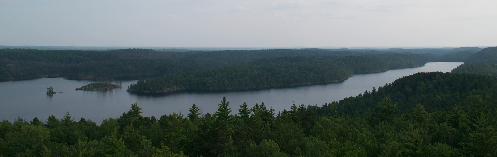

Everything a visitor reads lives in the `content/` folder: your home page, your posts, an essay or project you want to share. Open it and the top level looks like this:

```
content/
├── _index.md      # home page
├── about/
├── blog/          # your posts
└── pages/         # the onboarding guides
```

It's all Markdown, organized into folders, and each `index.md` is a page on the site. Once the look and feel are settled, this is where you'll spend most of your time: writing.

Since it's plain Markdown, you can open any page's `index.md` in a text editor (Sublime, VS Code, whatever you like) and edit it yourself, in your own voice. That's a natural fit for the About page or a blog post, where the words are the point.

## Markdown crash course

Markdown is a simple way to add formatting as you write. You type in plain text and sprinkle in a few light marks, a `#` here, some `**asterisks**` there, and the site turns them into headings, bold, links, and the rest. There's little to memorize, and the handful below covers almost everything you'll use.

### Headings organize a page

Use `##` for a section heading and `###` for a subheading. (The `#` level is reserved for the page title above.)

### Everyday text

You can make words **bold**, *italic*, or `monospaced`, and link to [another page](https://example.com). Separate paragraphs with a blank line. That's what creates the space between these blocks of text.

### Lists

Bulleted lists use `-`:

- Drop a thought here
- And another
- Nesting works too, with indentation

Numbered lists use `1.`:

1. First, write something
2. Then, refine it
3. Finally, publish

### Quotes and code

> Markdown lets you focus on writing. The site handles how it looks.

Wrap inline bits like `hugo server` in backticks. For a longer snippet, fence it with three backticks:

```js
function greet(name) {
  return `Hello, ${name}!`;
}
```

### Tables

| Element   | Markdown            |
| --------- | ------------------- |
| Bold      | `**text**`          |
| Link      | `[text](url)`       |
| Image     | `` |

## How to create a new page

A page is a folder with an `index.md` file inside it. That folder is a *page bundle*. It keeps the page's text and its images together in one place:

```
content/example/
├── index.md
└── images/
    ├── photo.jpg
    └── diagram.png
```

Open that `index.md` and it begins with a few settings fenced by `---`, the *front matter*, followed by your writing:

```
---
title: "About"
description: "Who I am and what I make."
---

I'm a designer and writer based in Portland,
sharing projects and the occasional note.
```

The front matter is just a handful of values like the title and a short description; leave them to Claude or tweak them by hand. Everything below it is ordinary Markdown, like the rest of your pages.

To add a page, just ask. For a single one, say something like *"add a Contact page with my email and social links."* Claude creates the bundle, writes the front matter, and (if you like) adds it to the menu.

When you want a whole collection instead of one page, ask for a *section*: a folder that holds many pages of the same kind, the way `blog/` holds your posts. For example, *"Let's add a Projects section where each project gets its own page."* Claude sets up the section along with a landing page that lists everything inside, ready for you to fill.

## Images

To add an image, drop a photo into the page's `images/` folder and reference it with a normal Markdown image. A wide photo fills the column edge to edge. The site automatically makes it responsive, fast, and privacy-safe. It even strips the GPS location that phones embed in photos:



When you want a caption (or to cap how wide an image gets), use the `image` shortcode instead. It centers the image by default; add `width` to keep it from filling the whole column:



## Emoji

Paste emoji straight into your text and they show up as-is: 🎉 📷 ✅ 🌿

You can also type them by name between colons, like `:tada:` for 🎉 or `:camera:` for 📷. This shorthand relies on one setting, `enableEmoji: true` in `hugo.yaml`, which the site turns on for you (Hugo ships with it off). Browse the [shortcode names](https://gist.github.com/rxaviers/7360908) to find the one you want.

## Extending Markdown

When you want something Markdown can't express (a video, a map, an interactive chart), the site uses a **shortcode** rather than raw HTML: a small, reusable tag like the `image` one above. Ask Claude to build it once, then drop a tag like `` into any page and reuse it wherever you like.

That's the whole toolkit. Anything you can write in Markdown renders with this same clean styling, so go ahead and make it your own.

## What's next

- **[Personalize](/pages/personalize/)**: change the look and feel of your site.
- **[Launch](/pages/launch/)**: put your site online.
