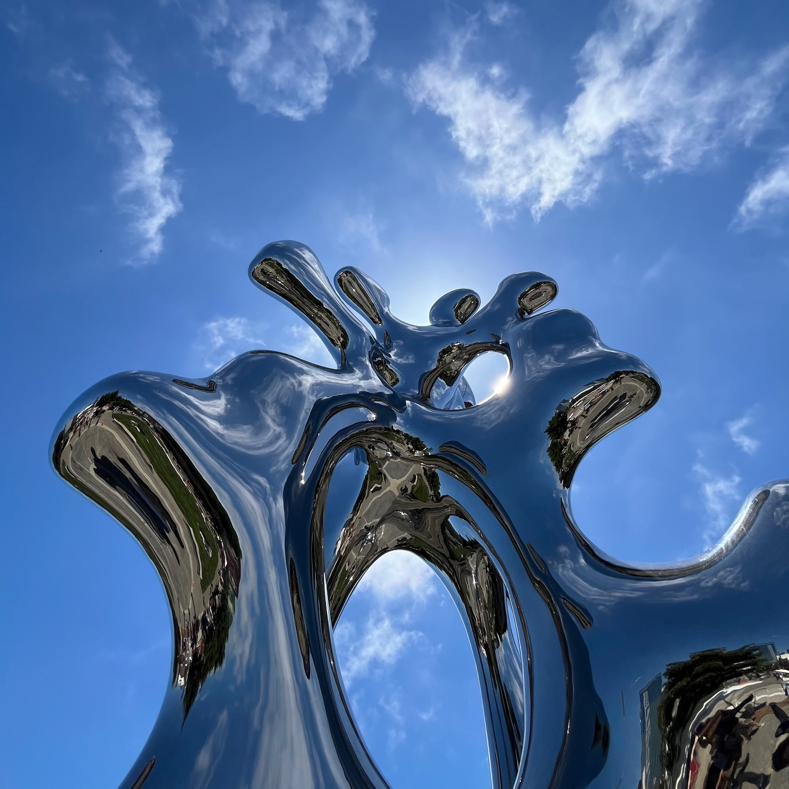

Everything on your site is written in **Markdown** — a simple way to format text with plain characters, no buttons or toolbars. Below is the whole toolkit and exactly how each piece looks here. It's a live example, too: edit this page and watch it change.

## Headings organize a page

Use `##` for a section heading and `###` for a subheading. (The `#` level is reserved for the page title above.)

### Text you write every day

You can make words **bold**, *italic*, or `monospaced`, and link to [another page](https://example.com). Separate paragraphs with a blank line — that's what creates the space between these blocks of text.

## Lists

Bulleted lists use `-`:

- Drop a thought here
- And another
- Nesting works too, with indentation

Numbered lists use `1.`:

1. First, write something
2. Then, refine it
3. Finally, publish

## Quotes and code

> Markdown lets you focus on writing. The site handles how it looks.

Wrap inline bits like `hugo server` in backticks. For a longer snippet, fence it with three backticks:

```js
function greet(name) {
  return `Hello, ${name}!`;
}
```

## Tables

| Element   | Markdown            |
| --------- | ------------------- |
| Bold      | `**text**`          |
| Link      | `[text](url)`       |
| Image     | `` |

## Emoji

Paste emoji straight into your text and they appear as-is: 🎉 📷 ✅ 🌿

You can also type them by name between colons — `:tada:` becomes 🎉 and `:camera:` becomes 📷.

## Images

Drop a photo into this page's `images/` folder and reference it with a normal Markdown image. The site automatically makes it responsive, fast, and privacy-safe (it even strips the GPS location that phones embed in photos):



When you want a caption — or to cap how wide an image gets — use the `image` shortcode. It centers the image by default; add `width` to keep it from filling the whole column:



That's the whole toolkit. Anything you can write in Markdown renders with this same clean styling — so go ahead and make it your own.
